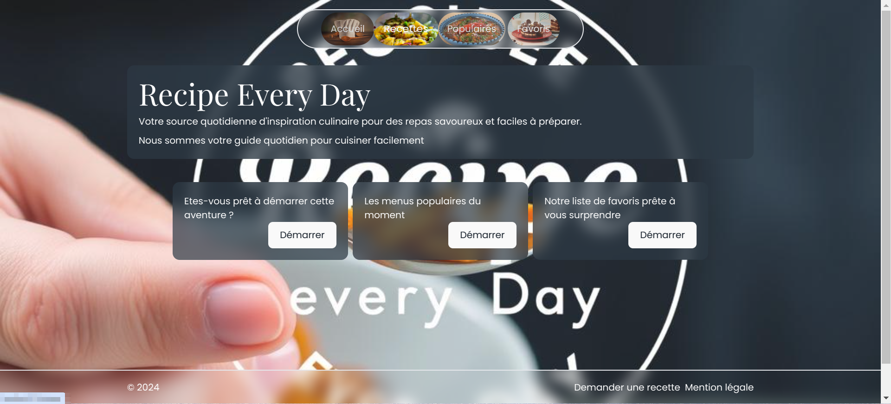

# FullStack MERN project by Rktoo
# Under Construction 😊



Bienvenue dans mon projet **Recipe Every Day**. C'est un projet séparer en deux couches distinctes pour s'initier aux API avec le framework ExpressJS.

## Table des matières
- [Description](#description)
- [Fonctionnalités](#fonctionnalités)
- [Installation](#installation)
- [Configuration](#configuration)
- [Utilisation](#utilisation)
- [Licence](#licence)

## Description
C'est un projet fullstack qui utilise ReactJs pour le côté client et ExpressJs pour le côté serveur. Et la base de donnée est avec MongoDB qui est facile les intéractions.

## Fonctionnalités
En cours de construction

## Installation
1. **Clonez le dépot** :
    ```bash
    git clone https://github.com/Rktoo/Recipe-EveryDay.git
    cd Recipe-EveryDay
2. **Installer le front-end** :
    ```bash
    cd recette-client
    npm i
3. **Installer le back-end** :
    ```bash
    cd ..
    cd recette-backend
    npm i
4. **Activer le service mongoDB pour pouvoir l'utiliser** :
    window :
    tapez dans le terminal : services.msc
    Et recherchez le service mongoDB Server correspondant et activez-le.
    
## Configuration
1. **Faites le seed de la base de donnée** :

    Depuis le repertoire recette-backend
    ```bash
    node .\scripts\insertRecipes.js
2. **Démarrez ensuite le serveur** :
    ```bash
    npm start
3. **Démarrez le côté client** :
Depuis le repertoire recette-client
    ```bash
    npm run dev

## Utilisation
1. **Vous aurez des recettes que vous pourrez essayer à la maison**
2. **Les visiteurs peuvent demander des recettes sans s'inscrire. Il n'y a pas d'inscription. 😊**
3. **Aimez les recettes.**
3. **Ajouter les demandes de recette sur le site depuis l'administrateur du backend. En cours de construction**

## LICENCE
1. **Ce projet est sous la licent MIT.**

# Merci de votre visite. Le projet est en cours de finalisation !